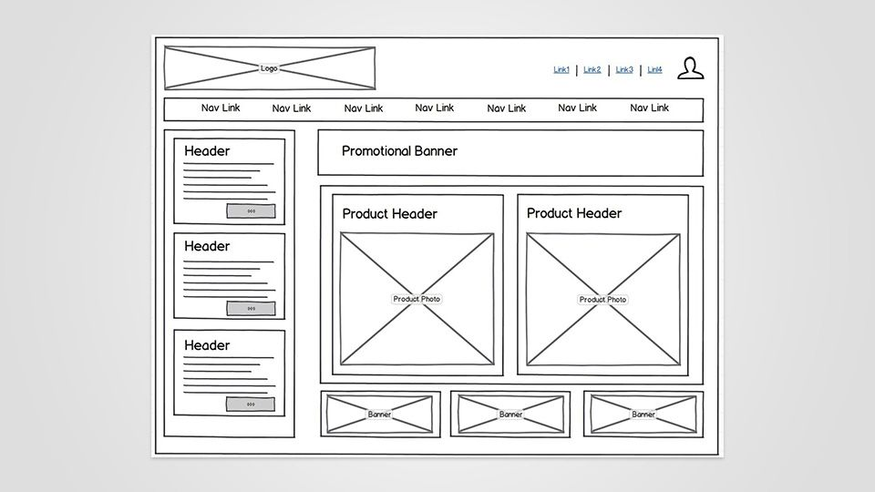

## 🔘 Добавление кнопки на сайт

## Контекст задачи

Компания «[PinkWindow](https://gr-move.github.io/Portfolio/Cases/Case-1/site/index.html)» (онлайн-магазин товаров для растениеводства) выявила, что 70% посетителей уходят со страницы товаров, не оформляя заказ. Опрос клиентов показал: многие новички нуждаются в консультации по выбору растений и уходу за ними, но текущая форма обратной связи скрыта в футере сайта.

> 📌 **Цель**: Увеличить конверсию в заказы на 20% за 2 месяца за счет добавления удобной кнопки вызова агронома.

## Содержание проекта

1. [Выявления требований](/IdentificationOfRequirements.md)
2. [User Story от пользователей](/IdentificationOfRequirements.md##User-Story)
3. Диаграммы [User Flow](/FlowChart.md) + User Flow Diagram + C4
4. Вместо классических диаграмм:
   + [Схема расположения Wireframe](/README.md###Схема-расположения-Wireframe)
   + [Эскиз интерфейса (Набросок UI или mockup)](/README.md###Визуализация-кнопки)
5. Обновление документации
6. [Используемые технологии](/TechStack.json)

  

---

## Контент

### Схема расположения Wireframe

### Визуализация кнопки

'''HTML

<a class="iksweb" href="https://iksweb.ru/tools/cnopka/" title="Нажми на меня">Нажми на меня</a>
'''

graph TD
    A[BPMN] --> B[Jira]
    A --> C[REST API]
    C --> D[Swagger]