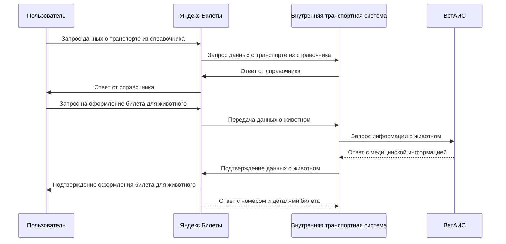
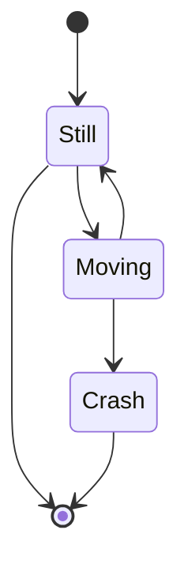
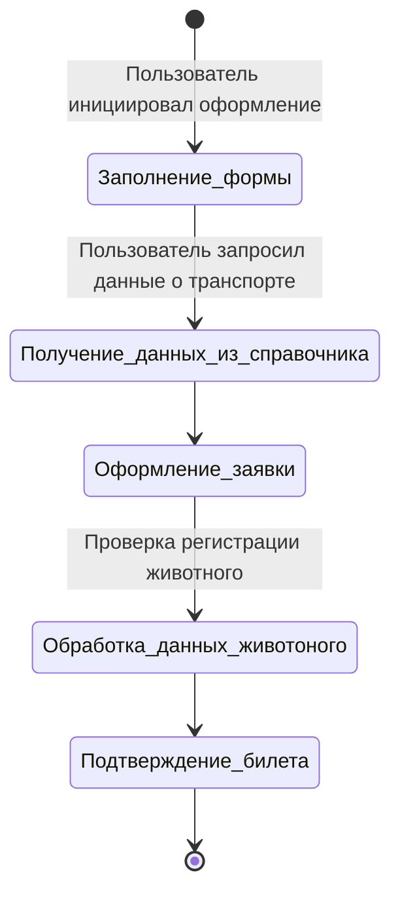
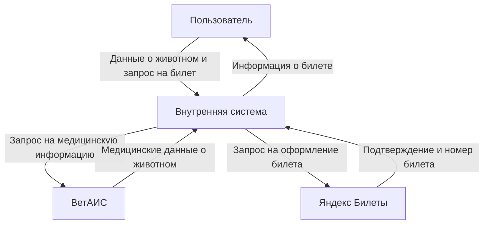
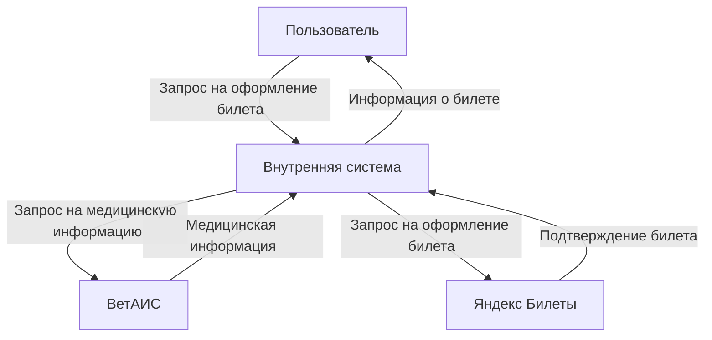
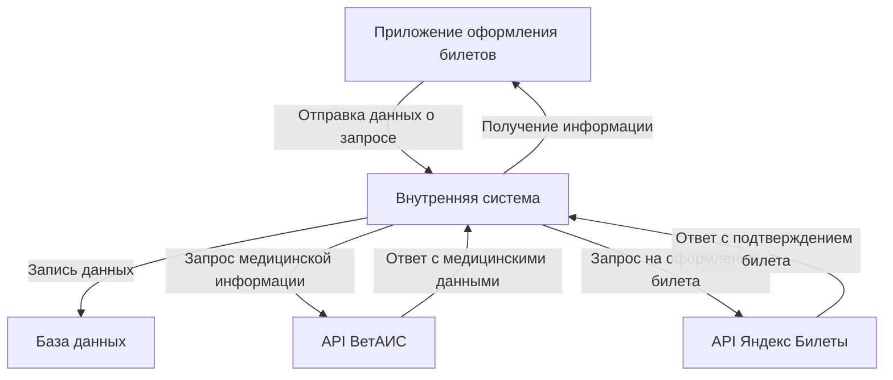

### Диаграммы для представления требований

1. Диаграмма последовательностей (Sequence Diagram):
   - Отображает взаимодействие между пользователем, внутренней системой, "Яндекс Билетами" и "ВетАИС" при оформлении билета. Это помогает понять порядок выполнения операций и временные задержки.

---
title: Диаграмма последовательностей (Sequence Diagram)
---

2. Диаграмма состояний (State Diagram):
   - Моделирует состояния, через которые проходит заявка на перевозку животного. Диаграмма может включать такие состояния, как:
     - Новая заявка
     - Обработка
     - Ожидание данных от "ВетАИС"
     - Подтвержденный билет и т.п.

---
title: Диаграмма состояний (State Diagram)
---

3. Диаграмма потоков данных (Data Flow Diagram):
   - Отображает поток данных между системами (внутренняя система, "Яндекс Билеты", "ВетАИС"). Показывает, какие данные передаются, откуда они берутся и как они используются. Это поможет визуализировать, где данные могут быть потеряны или искажены.

4. Диаграмма C4:
   - Состоит из четырех уровней: контекстная диаграмма, диаграмма контейнеров, диаграмма компонентов и диаграмма кода. В вашем случае мы сосредоточимся на контекстной диаграмме и диаграмме контейнеров для случаев интеграции систем "Яндекс Билеты" и "ВетАИС" для оформления билета на перевозку животного.

