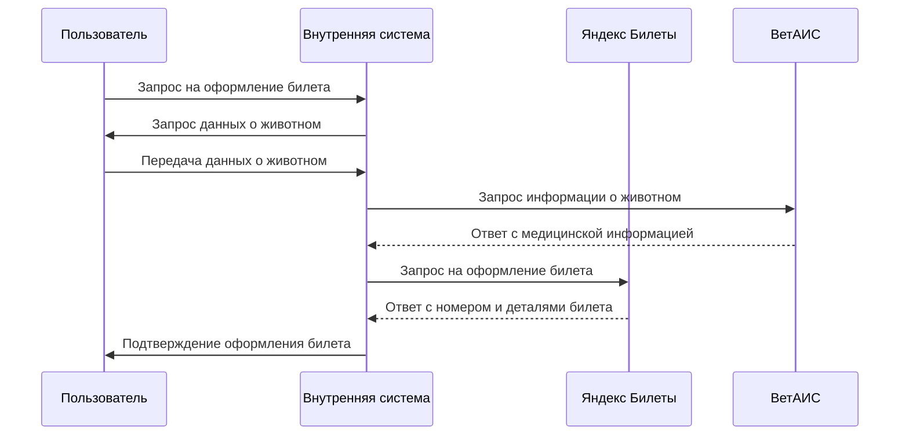
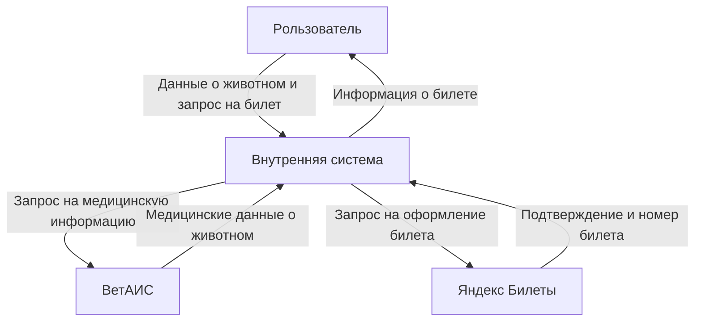
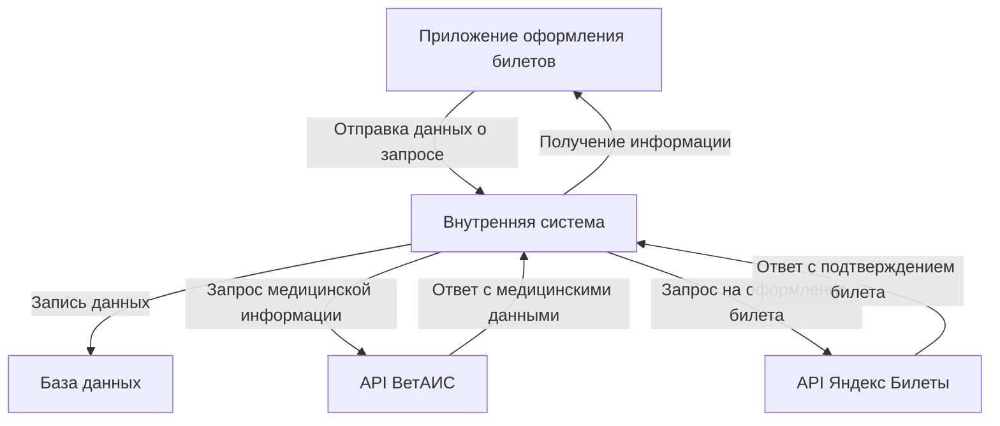

### Диаграммы для представления требований

1. Диаграмма последовательностей (Sequence Diagram):
   - Отобразите взаимодействие между пользователем, внутренней системой, "Яндекс Билетами" и "ВетАИС" при оформлении билета. Это поможет понять порядок выполнения операций и временные задержки.



2. Диаграмма состояний (State Diagram):
   - Моделируйте состояния, через которые проходит заявка на перевозку животного. Это может включать состояния, как:
     - Новая заявка
     - Обработка
     - Ожидание данных от "ВетАИС"
     - Подтвержденный билет и т.п.

```mermaid
stateDiagram;
    Новая_заявка: Инициировать оформление
    Данные_о_животном_собраны: Собраны данные
    Ожидание_ответа_от_ВетАИС: Ожидание ответа от ВетАИС
    Медицинская_информация_получена: Получен ответ
    Запрос_на_оформление_билета_отправлен: Запрос на оформление билета отправлен
    Билет_оформлен: Билет оформлен
    Ошибка: Ошибка

    Новая_заявка --> Данные_о_животном_собраны: Инициировать оформление
    Данные_о_животном_собраны --> Ожидание_ответа_от_ВетАИС: Собраны данные
    Ожидание_ответа_от_ВетАИС --> Медицинская_информация_получена: Получен ответ
    Медицинская_информация_получена --> Запрос_на_оформление_билета_отправлен: Отправить запрос
    Запрос_на_оформление_билета_отправлен --> Билет_оформлен: Получен билет
    
    Ожидание_ответа_от_ВетАИС --> Ошибка: Ошибка при получении данных
    Медицинская_информация_получена --> Ошибка: Ошибка обработки данных
    Запрос_на_оформление_билета_отправлен --> Ошибка: Ошибка при оформлении
```

3. Диаграмма потоков данных (Data Flow Diagram):
   - Отобразите поток данных между системами (внутренняя система, "Яндекс Билеты", "ВетАИС"). Покажите, какие данные передаются, откуда они берутся и как они используются. Это поможет визуализировать, где данные могут быть потеряны или искажены.



4. Диаграмма C4:
   - Она состоит из четырех уровней: контекстная диаграмма, диаграмма контейнеров, диаграмма компонентов и диаграмма кода. В вашем случае мы сосредоточимся на контекстной диаграмме и диаграмме контейнеров для случаев интеграции систем "Яндекс Билеты" и "ВетАИС" для оформления билета на перевозку животного.



