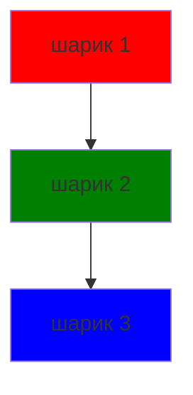

## Содеражание
1. Наброски
2. Литература

## Наброски

| Z              | Квадрант 1        | Квадрант 2        |
|----------------|-------------------|-------------------|
| **Квадрант 3** | Содержимое 3      | Содержимое 4      |
| **Квадрант 4** | Содержимое 1      | Содержимое 2      |

<table>
  <tr>
    <th></th>
    <th>Квадрант 1</th>
    <th>Квадрант 2</th>
  </tr>
  <tr>
    <th>Квадрант 3</th>
    <td>Содержимое 1 Дополнительная строка 1</td>
    <td>Содержимое 2 Дополнительная строка 2</td>
  </tr>
  <tr>
    <th>Квадрант 4</th>
    <td>Содержимое 3 Дополнительная строка 3</td>
    <td>Содержимое 4 Дополнительная строка 4</td>
  </tr>
</table>

## Литература
- 