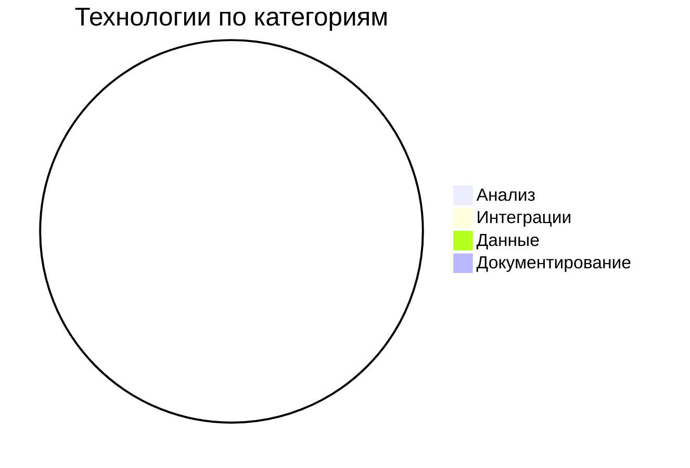

# 🛠 Технологический стек
        
        > ⚠️ **Этот файл автоматически обновляется. Ручные правки будут перезаписаны!**
        
        ## Общие принципы
        - Используем только проверенные технологии
        - Стек обновляется ежеквартально
        - Критерии выбора: производительность, документация, сообщество
        
        ### Технологический стек (Тестовые данные):
        - Нотации: BPMN 2.0, UML (Use Case, Sequence), C4 Model
        - Документация: ГОСТ 34, Техническое задание, Архитектурное решение
        - REST API: Swagger/OpenAPI, curl/requests тесты
        - Язык: Markdown + HTML + CSS
        
        ## Автоматически генерируемые данные:

| Кейс      | Анализ     | Интеграции      | Данные           | Документирование   |
|-----------|------------|-----------------|------------------|--------------------|
| TechStack | Jira, BPMN | REST API, Kafka | PostgreSQL, JSON | Markdown, Swagger  |

